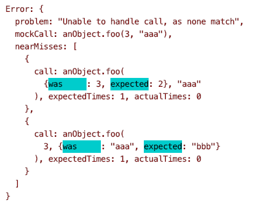

# thespian

`thespian` is a mocking framework with a sophisticated approach to argument matching
and providing useful error messages when arguments fail to match.

It is written in Typescript and respects types in mocks.
It uses [`mismatched`](https://github.com/rickmugridge/mismatched), 
a sophisticated composable matcher for matching arguments of method and function calls.

Thespians are like mocks - they play a role.

# Short Docs

 - To create a `Thespian` in order to create mocks:
   - `const thespian = new Thespian();`
 - To create a mock for a class or interface (with a given name, used in error messages):
   - `const mockCheck = thespian.mock<Check>("check");`
    - To specify an expected method call:
      - `mockCheck.setup(c => c.match()).returns(() => 4);`
    - To specify an expected method call to be called a specific number times:
      - `mockCheck.setup(c => c.match2("target")).returns(() => "ok").times(2);`
 - To create a mock for an object property (with a given name, used in error messages):
   - `const mockCheck = thespian.mock<Check>("check");`
    - To specify an expected property access:
      - `mockCheck.setup(c => c.prop).returns(() => 4);`
    - To specify an expected property access to be called a specific number times:
      - `mockCheck.setup(c => c.prop).returns(() => 5).times(2);`
 - To create a mock for a function:
   - `const mockFn = thespian.mock<(n: number)=>number>("fun");`
    - To specify an expected function call:
      - `mockFn.setup(f => f(5)).returns(() => 2);`
    - To specify an expected function call to be called a specific number times:
      - `mockFn.setup(f => f(100)).returns(() => 20).timesGreater(0);`
- To access the underlying mock for use in tests:
   - `const check = mockCheck.object;`
 - To verify that all expected mock calls and property accesses have happened (usually in an _afterEach()_):
   - `thespian.verify();`
   
Mocked methods and function with the same arguments can return a series of results:

    - To specify a mocked method call with the same arguments but different results (4 is returned in the first call, and 5 on the second):
      - `mockCheck.setup(c => c.match()).returns(() => 4);`
      - `mockCheck.setup(c => c.match()).returns(() => 5);`
    - To specify a mocked property access with different results (4 is returned in the first call, and 5 on the second):
      - `mockCheck.setup(c => c.prop).returns(() => 4);`
      - `mockCheck.setup(c => c.prop).returns(() => 5);`
     - To specify a mocked method function with the same arguments but different results (4 is returned in the first call, and 5 on the second):
       - `mockCheck.setup(c => f(5)).returns(() => 4);`
       - `mockCheck.setup(c => f(5)).returns(() => 5);`

Possible `returns`:
  - `.returns(()=>45)`, a function that provides the result. 
     The result can depend on the actual arguments. Eg, `.returns((a,b) => a)`.
  - `.returnsVoid()` for when the mocked method/function does not return a result.

Possible `times` checks:
  - `.times()`, a specific `number`
  - `.timesAtLeast()`, the minimum `number` of times
  - `.timesAtMost()`, the maximum `number` of times

# Example Error Message

When a call to a mocked method or function fails to match, it's useful to know whether there were any near misses.
Here's an example, where there are two near misses:

# Also see:
 * See [Thespian By Example](ThespianByExample.md)
 * See [Thespian Design Decisions](DesignDecisions.md)
 * See [Common Mocking Anti-Patterns](CommonMockingAntiPatterns.md)
    
